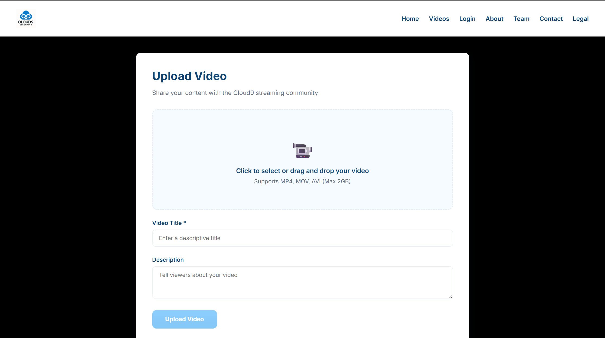
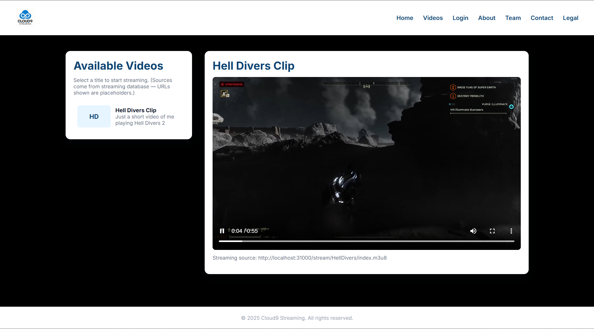
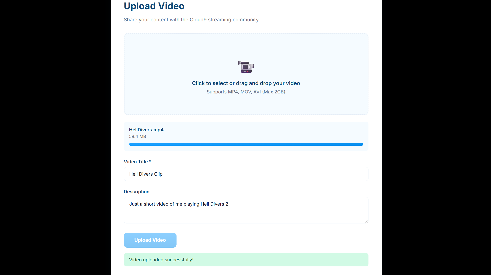

# Cloud Nine

Cloud Nine is an easy to use video streaming platform designed to run on Kubernetes. Streaming is handled seamlessly by automatically transcoding uploaded videos and serving through browser-supported HTTP Live Streaming (HLS). Cloud Nine puts the power of video streaming into your hands with its simple installation process through this GitHub page.


## Screenshots






## Installation

To install Cloud Nine, simply clone this repository

```bash
  git clone https://github.com/CSC495-Cloud-Nine/Cloud-Nine.git
```
    
## Requirements

The Kubernetes command-line tool [kubectl](https://kubernetes.io/docs/tasks/tools/) is required to run Cloud Nine
## Deployment

To deploy this Cloud Nine run the following in the Cloud Nine directory

```bash
  kubectl apply -f ./k8s
```


## Usage

### Accessing

By default, the webpage will be available on port 31000. If you wish to change the port, follow these steps:

- Stop the ingress controller using
```
kubectl delete -f ./k8s/ingress.yaml
``` 
- Open `ingress.yaml`
- Change line 81 to the desired port that you want the webpage to run on
```
nodePort: {PORT}
```
- Restart the ingress controller using
```
kubectl apply -f ./k8s/ingress.yaml
```

### Uploading Videos

The page to upload videos is not accessible via the webpage. Instead go to `yourweb.page:port/upload`.

You should see a form that asks you for the video file, video title, and video description.

The upload process can take a while depending on your file size.

Note: At the end of the upload process the progress bar will hang at the last 95%. This is normal and means the video is being transcoded. DO NOT leave the page until you see a success or error message.



Once you see that your video has been successfully uploaded, you can go to the videos page to watch your video being streamed!
